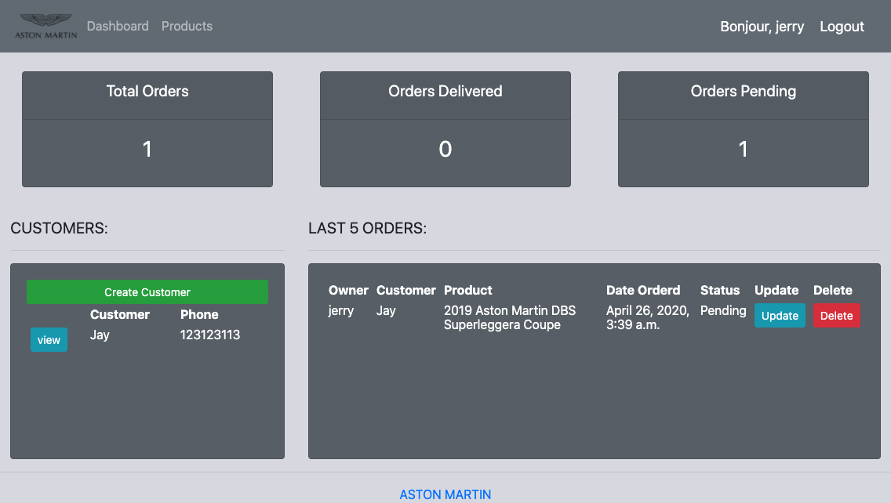
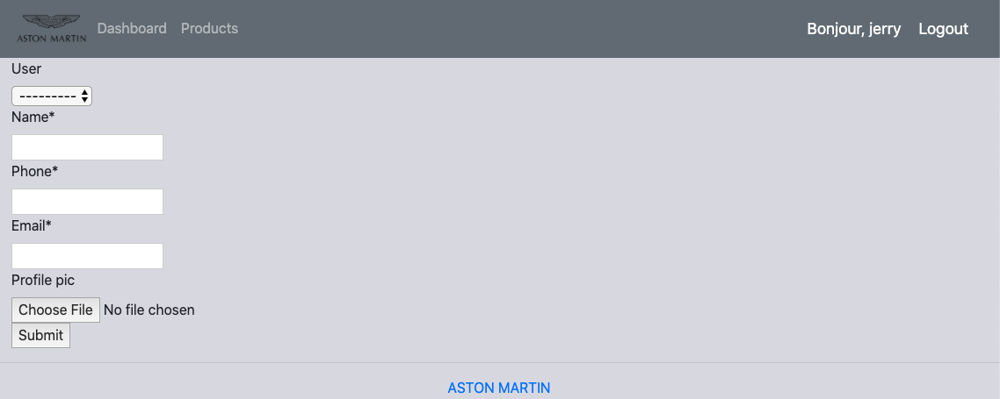
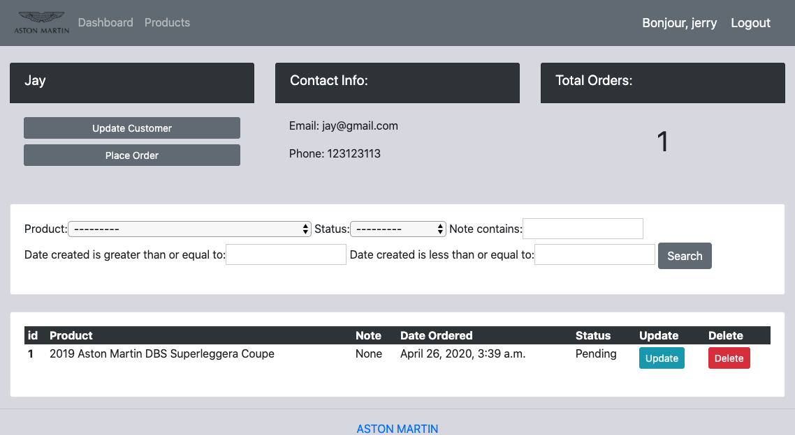
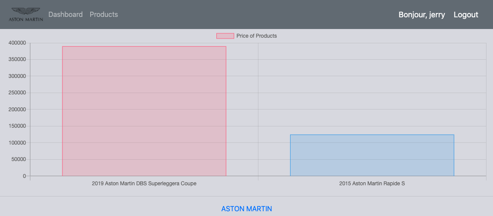
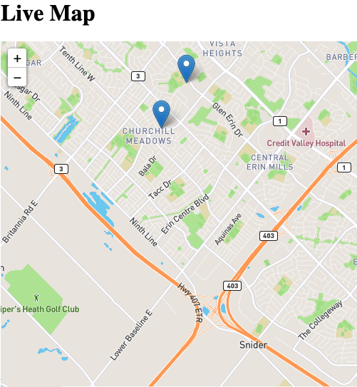

# FunDashboard
A fun dashboard by Django &amp; React &amp; Kafka
### Main Page

### Customer Page


### Product Page

### Bus Map Page


### Kafka Setup
Running the following commands under where Kafka was installed
##### Zookeeper
```
bin/zookeeper-server-start.sh config/zookeeper.properties
```
##### Kafka Server
```
bin/kafka-server-start.sh config/server.properties
```
### Real-time Bus Data Generator
```
python bus_data1.py
python bus_data2.py
```
### Endpoint
`/bus/data/`
